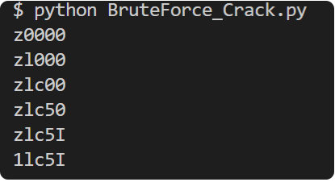

# BruteForce Crack


We were given a source code of how the flag was encoded. 


```python
#!/usr/bin/env python3
import string
from Crypto.Util.number import *

flag = b'CSI{?????}'

k = 0x5a78cf727b0b33b6d9e21ff92c30fe0e68a025f2887c97429e244d2e01

tab = list(string.ascii_lowercase + string.ascii_uppercase)
for i in range(1,10):
    tab.append(chr(i + ord('0')))

prefix = "00000" #The FLAG HERE

def verif(prefix):
    string = "CSI{" + prefix +  "}"
    flag = bytes(string,'utf-8')
    l = len(flag)

    part1, part2 = flag[: l // 2], flag[l // 2:]

    x, y = bytes_to_long(part1), bytes_to_long(part2)

    return abs(x**3*y**3 - 3*x**3*y**2 + 3*x**2*y**3 + 3*x**3*y - 9*x**2*y**2 + 3*x*y**3 - x**3 + 9*x**2*y - 9*x*y**2 + y**3 - 3*x**2 + 9*x*y - 3*y**2 - 3*x + 3*y - k)

counter = 0
mini = verif(prefix)

while(verif(prefix)):
    temp = prefix
    for i in range(1, len(tab)):
        temp = temp[:counter] + tab[i] + temp[counter + 1:]
        if(mini>min(mini,verif(temp))):
            mini = verif(temp)
            prefix = temp
    counter = (counter+1) % 5

    print(prefix)
    print(verif(prefix))
```

    Result ↓ ↓
        
